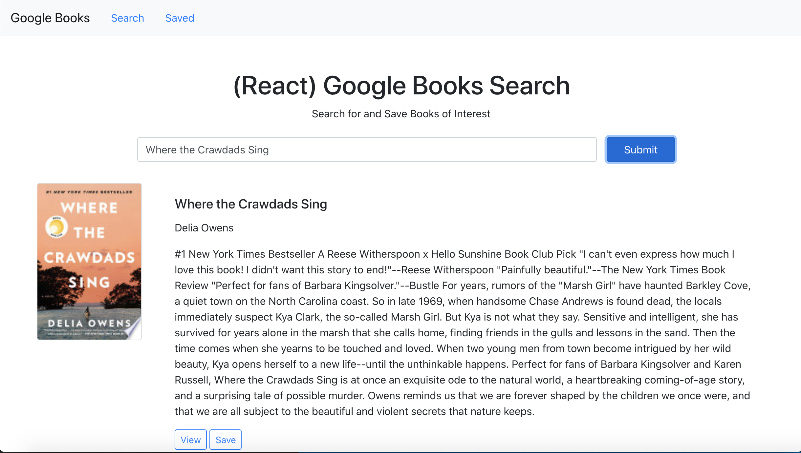

# Google Books Search

<h2>Overview</h2>

**Deployed Site:** https://kd-google-books.herokuapp.com/

**Technologies Used:** React, React Bootstrap, React Router Dom, Mongoose, MongoDB, Axios, Express, Node, JavaScript, Heroku, HTML, CSS

**Sources:** Referenced several previous class activities for file structure and app functionality, as well as StackOverflow.com & ReactJS.org for API calls and populating page data.

**Contact:** <a href="mailto:kayla.dunphe@gmail.com">kayla.dunphe@gmail.com</a>

**Goal:** Create a React-based Google Books Search app.

<h2>Screenshots</h2>

